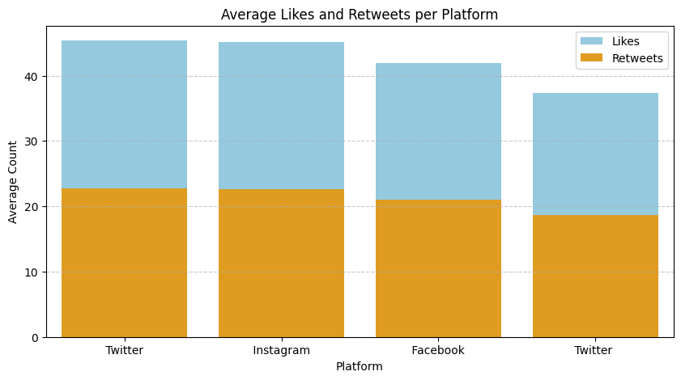
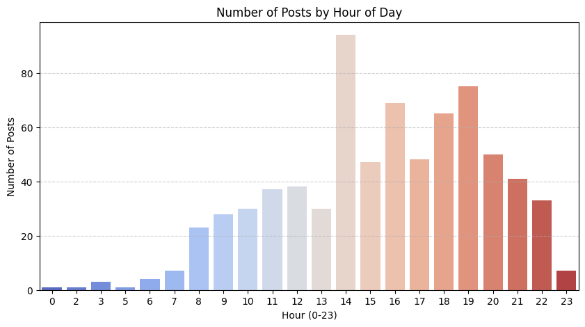

# Social Media Sentiment Analysis Project

## 📊 Project Overview
This project analyzes sentiment and user engagement patterns in Persian social media texts. The goal is to classify emotions in social media posts and understand user interaction patterns across different platforms.

## 📈 Key Visualizations

### 1. User Engagement by Platform

*Analysis of average likes and retweets across different social media platforms*

### 2. Posting Patterns Throughout the Day

*Distribution of social media posts across different hours of the day*

## 🔍 Analysis Results

### Top Performing Content
- **Top 10 Posts**: Identified posts with highest likes and retweets
- **High-engagement Platforms**: Instagram and Twitter showed highest user interaction
- **Peak Activity Hours**: Evening hours showed maximum user activity

### Sentiment Distribution
- Successfully classified posts into Positive, Negative, and Neutral sentiments
- Analyzed sentiment patterns across different platforms and time periods

## 🛠 Technical Implementation

### Technologies Used
- **Python** - Primary programming language
- **Pandas** - Data manipulation and analysis
- **Seaborn & Matplotlib** - Data visualization
- **NLTK VADER** - Sentiment analysis
- **Google Colab** - Development environment

### Key Features
- **Sentiment Classification**: Automated emotion detection in Persian text
- **Temporal Analysis**: Pattern analysis across hours, days, and months
- **Engagement Metrics**: Analysis of likes, retweets, and user interactions
- **Platform Comparison**: Performance comparison across social media platforms

## 📁 Project Structure

```
social-media-data-analysis/
├── data/
│ └── sentimentdataset.csv
├── analysis/
│ └── social-media-sentiment-engagement.ipynb
├── report/
├── images/
│ ├── engagement_platform.png
│ └── posts_hour.png
├── requirements.txt
└── README.md
```

## 🚀 Getting Started

### Prerequisites
- Python 3.7+
- Jupyter Notebook or Google Colab
### Installation
```
pip install -r requirements.txt
```
### Usage
1. **Clone the repository**
   ```bash
   git clone https://github.com/SamyarZamani/social-media-data-analysis.git
   cd social-media-data-analysis
   ```
2. **Open the notebook**
   ```
   jupyter notebook social-media-sentiment-engagement.ipynb
   ```

## 📊 Data Description

The dataset includes:
- Text content of social media posts  
- Sentiment labels (**Positive**, **Negative**, **Neutral**)  
- Timestamp information  
- User and platform data  
- Engagement metrics (Likes, Retweets)  
- Geographic and temporal features  

---

## 🎯 Key Findings

- **Platform Performance:** Instagram consistently showed higher engagement rates  
- **Timing Matters:** Posts published in evening hours received more interaction  
- **Content Patterns:** Positive sentiment posts generally received more engagement  
- **User Behavior:** Clear patterns in user activity throughout the day and week  

---

## 👥 Contributors

- Data Analysis and Visualization  
- Sentiment Classification  
- Pattern Recognition  

---

## 📄 License

This project is open source and available under the **MIT License**.
